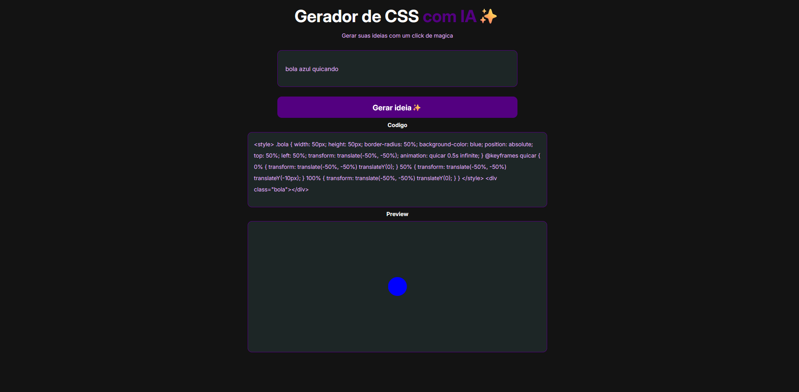

# <h1>Gerador-de-codigos-CSS-com-IA</h1>
 

Esse é um gerador de codigos css simple que fiz ele utiliza IA para gerar os codigos CSS pedidos

 
 
<h2>Tecnologias usadas</h2>

HTML

CSS

JavaScript

 

 

Gere seus codigos CSS com um click

